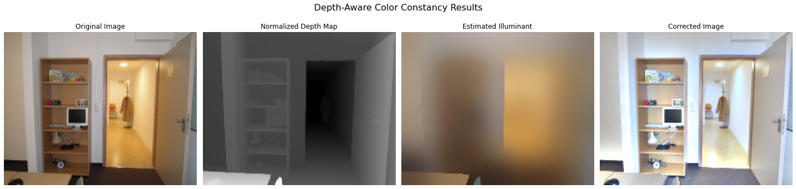

# Depth Map Color Constancy

This repository contains a Python implementation of the paper **"Depth map color constancy"**, published by Marc Ebner and Johannes Hansen in 2013.

## Example Result

Below is an example of the algorithm's effect on a sample scene.

*On the left is the original image, and on the right is the color-corrected result.*

## Usage

To run the project, ensure that the required files `im.png` (RGB image) and `im.npy` (depth data) are in the same directory as the main script.

Required Python libraries:
* `opencv-python`
* `numpy`
* `matplotlib`

## Reference

This work is based on the following paper:

@article{ebner2013depth,
  title={Depth map color constancy},
  author={Ebner, Marc and Hansen, Johannes},
  journal={Bio-Algorithms and Med-Systems},
  volume={9},
  number={4},
  pages={167--177},
  year={2013},
  publisher={De Gruyter}
}
